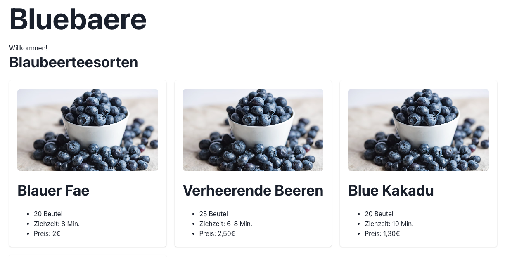

# Bluebaere Shop 
Eine React BeispielApp mit Chakra UI.




- [Chakra UI](https://chakra-ui.com/getting-started)

## Installation

### Grundgerüst ertellen
```bash
npm create vite@latest
```
- Project name: bluebaere-shop
- Select a framework: react
- Select a variant: react JavaScript

```bash
cd bluebaere-shop
npm install
npm run dev
```

### Chakra UI Komponenten intallieren
```bash
npm install @chakra-ui/react @emotion/react @emotion/styled framer-motion
```
